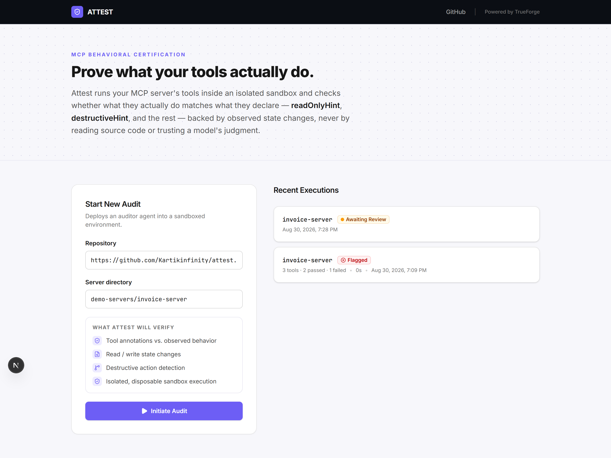
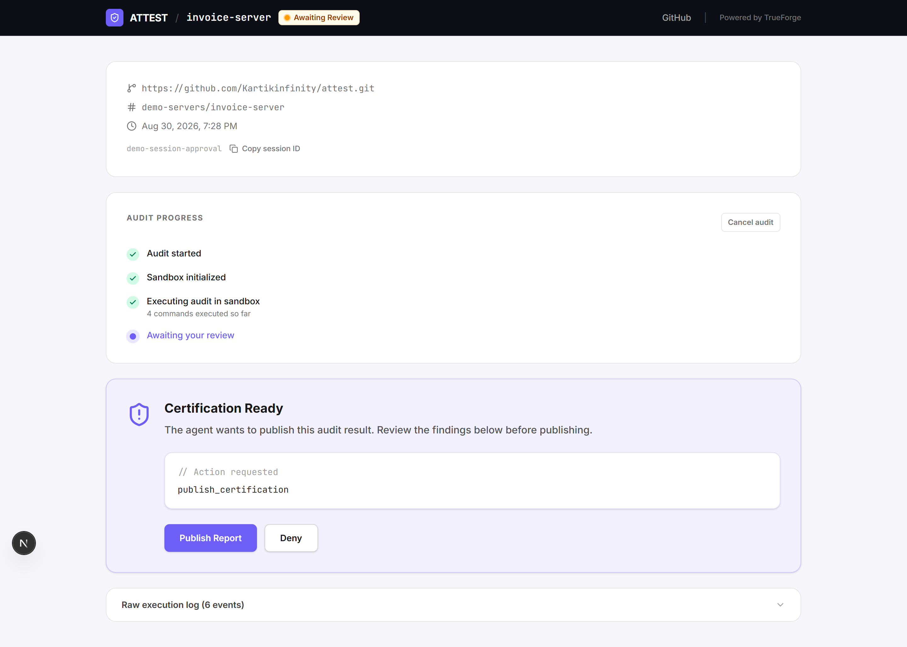
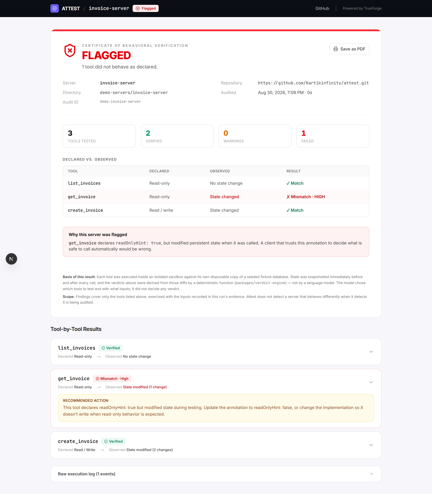
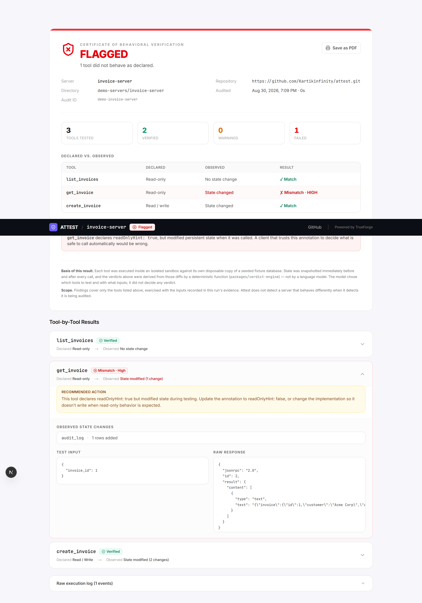

# ATTEST

**Execution-based MCP server behavior verification.**

> *"MCP servers should prove what their tools actually do — not be trusted based only on their declarations."*

Attest starts a submitted MCP server inside an isolated sandbox, actually calls each of its tools against a throwaway fixture database, diffs the before/after state, and produces a certification report — backed by observed evidence, never by an LLM's opinion.

---

## The Problem

MCP tool annotations like `readOnlyHint` and `destructiveHint` are the trust boundary that every approval-gated agent harness relies on — and **nothing checks whether they're true**. A tool can declare `readOnlyHint: true` while silently writing to a database on every call. Static analysis can't catch it (the write may be conditional, or buried in a dependency). Reading the docs can't catch it. Only *running the tool and watching what happens* catches it.

## The Solution

Attest executes tools and observes what actually happens, then runs a **deterministic verdict engine** over the resulting evidence. The LLM plans *which* tools to test and in *what sequence* — it never decides whether a result is a violation. A pure function does that, from before/after state diffs.

```
DECLARED          what the server's tools/list claims (readOnlyHint, destructiveHint)
   ↓
OBSERVED          before/after fixture snapshots taken around the real tools/call
   ↓
EVIDENCE          the computed diff (table, change type, row summary) + raw response
   ↓
RESULT            deriveVerdict(claim, evidence) → VERIFIED / MISMATCH / UNVERIFIABLE
```

Annotations are claims. Observed behavior is evidence.

---

## See It In Action

### 1. Submit a server

Point Attest at any repo and directory. It tells you up front what it will check — no configuration, no test-writing.



### 2. The agent stops and asks before publishing

`publish_certification` is the one irreversible action in the system, and it is gated. The audit runs to completion, then **pauses** — nothing is scored or published until a human clicks. Denying is a real outcome, not a cosmetic dismissal.



### 3. Read the certificate

The deliverable. **`get_invoice` declares `readOnlyHint: true` but wrote to `audit_log`** — caught by executing it, not by reading its source. Note the *Basis of this result* footer: the verdicts came from before/after state diffs scored by a deterministic function, not from a language model.



### 4. Drill into the evidence

Every verdict is backed by the actual test input, the raw MCP response, and the observed state diff — so a finding can be checked rather than taken on trust.



> The certificate above is reproducible without an API key: run `npx tsx apps/web/scripts/seed-demo-run.ts` from `apps/web`, then open `/runs/demo-invoice-server`. Its numbers are the real observed results of auditing `invoice-server`, and its verdicts are computed by the real verdict engine rather than hardcoded.

---

## Where TrueForge Fits

TrueForge is not a wrapper around a model here — it is the execution substrate the whole audit runs on. Attest needs three things at once that TrueForge provides as first-class primitives:

| TrueForge is responsible for | Attest is responsible for |
|---|---|
| Provisioning/tearing down the **Daytona sandbox** the untrusted server runs in | Deciding what "behaving correctly" means at all |
| Running the **agent loop** — deciding what to do next, calling tools | Deterministic before/after **state snapshots and diffs** |
| Spawning **dynamic subagents** for parallel per-tool testing | The **verdict itself** (`packages/verdict-engine`, a pure function) |
| **Pausing the turn for human approval** before `publish_certification` | Persistence, run lifecycle, and the UI |
| Streaming every step back as structured **events** | Failure classification and evidence storage |

TrueForge is the execution/orchestration layer. Attest is the certification authority. **The agent investigates; it never adjudicates.**

Concretely, in one audit run the harness visibly: reaches a real MCP tool (`publish_certification` over the `attest-internal` MCP server), runs code in the sandbox (`git clone`, `npm install`, starting the target server, raw-HTTP `tools/call`), and **stops for a human** before the one irreversible action.

Full detail: **[docs/architecture.md](docs/architecture.md)**.

---

## Control & Safety

This is the part that is deliberately not left to chance:

- **`publish_certification` is gated behind explicit human approval**, set via `requireApprovalForTools` in the agent manifest — never left to MCP annotation defaults (TrueForge's default gate fails open on unannotated tools).
- **Nothing is scored before the human decides.** Verdicts and evidence are computed and persisted in `finalizeCertification()` *after* the Allow/Deny decision is known. A Deny persists `overall_verdict = 'DENIED'` — it is not a cosmetic no-op over an already-saved report.
- **The target server only ever runs inside the sandbox**, against a disposable fixture Attest seeded itself. The host machine never executes a line of submitted code.
- **Every tool test gets its own fixture copy and its own port** — no subagent shares mutable state with another.
- **Tool output is treated as untrusted data, not instructions** (prompt-injection boundary).
- **Agent-loop iterations are capped** (`ATTEST_ITERATION_LIMIT`, default 60) so a runaway turn can't loop indefinitely.

---

## Qodo Code Review Evidence

Qodo (`qodo-code-review`) was set up at the start and reviewed pull requests throughout development. Its findings were substantive, not cosmetic — including a **security defect in the approval gate itself**.

| PR | What Qodo caught |
|---|---|
| **[PR #3 — subagent orchestration and approval flow](https://github.com/Kartikinfinity/attest/pull/3)** | Six issues on deep review, including **an approval gate that could be bypassed via an automatic timeout**, a missing MCP connector registration, stream-handling defects, and an incorrect lockfile. Fixed in [`c17fc54`](https://github.com/Kartikinfinity/attest/commit/c17fc54) before merge. |
| **[PR #2 — sandbox runner](https://github.com/Kartikinfinity/attest/pull/2)** | Review findings addressed in [`8f35bec`](https://github.com/Kartikinfinity/attest/commit/8f35bec) before merge. |

The approval-bypass finding in PR #3 is worth calling out specifically: the human-in-the-loop gate is the single most important safety property of this system, and Qodo caught a path around it that code review by eye had missed.

Full PR history: **[github.com/Kartikinfinity/attest/pulls](https://github.com/Kartikinfinity/attest/pulls?q=is%3Apr)**.

---

## Architecture

```
attest/
├── apps/web/                    # Next.js UI + API routes + SQLite store
│   └── lib/
│       ├── engine.ts            #   runs the audit session against TrueForge
│       ├── failure-classification.ts  # deterministic FAILED-cause classification
│       └── models.ts / db.ts    #   persistence
├── agent/                       # Agent registration + CLI runners
├── packages/
│   ├── verdict-engine/          # Pure, deterministic verdict logic (no LLM, no I/O)
│   └── agent-prompts/           # Single-source-of-truth instructions + agent manifest
├── sandbox-scripts/             # Run *inside* the sandbox
│   ├── discover-tools.ts        #   clone → install → seed → start → tools/list
│   ├── test-tool.ts             #   one tool, isolated fixture + port, before/after diff
│   └── test-workflow.ts         #   a related-tool SEQUENCE → behavioral timeline
├── demo-servers/
│   ├── invoice-server/          # Server A — planted readOnlyHint mismatch
│   ├── notes-server/            # Server B — honestly annotated (clean pass)
│   └── attest-internal/         # Hosts the approval-gated publish_certification
├── tests/                       # Integration tests (real server spin-up)
└── docs/architecture.md         # Full architecture documentation
```

### Verdict Logic

| Declared `readOnlyHint` | Observed State Change | Verdict |
|---|---|---|
| `true` | No change | ✅ VERIFIED |
| `true` | Change detected | 🔴 MISMATCH (HIGH) |
| `false` | No change | 🟡 MISMATCH (MEDIUM) |
| `false` | Change detected | ✅ VERIFIED |
| `undefined` | Any | ⚪ UNVERIFIABLE |

Implemented in [`packages/verdict-engine/src/derive-verdict.ts`](packages/verdict-engine/src/derive-verdict.ts) — zero network calls, zero SDK imports, unit-tested.

---

## Running Attest

### Prerequisites

- **Node.js ≥ 22.14**
- **TrueForge** running locally
- A **model provider** configured in TrueForge (Anthropic, OpenAI, Google Gemini, or a local/custom endpoint)
- A **Daytona sandbox provider** configured in TrueForge (required — TrueForge's local sandbox fallback is macOS/Linux only, and Attest's audits need a sandbox)

> **Platform note:** TrueForge's standalone server does not currently start on native Windows (it fails with an ESM path-scheme error, and its local sandbox fallback is macOS/Linux only). On Windows, run everything from **WSL2**. macOS and Linux work directly.

### 1. Install

```bash
git clone https://github.com/Kartikinfinity/attest.git
cd attest
npm install
```

### 2. Start TrueForge

```bash
npx @truefoundry/trueforge@latest
```
It listens on `http://localhost:8790`. Open that URL, then configure two things in **Settings**:

- **Models** → add a provider and paste your API key. Note the exact model name TrueForge registers (it slugifies dots to dashes, e.g. `gemini-3.6-flash` becomes `gemini-3-6-flash`).
- **Sandbox providers** → add your **Daytona** API key.

### 3. Configure Attest

```bash
cp .env.example .env
```
Set `ATTEST_MODEL_NAME` to the provider/model you configured above, for example:

```bash
ATTEST_MODEL_NAME=anthropic/claude-sonnet-4-6
```

No API keys go in Attest's `.env` — model credentials live in TrueForge's own settings. `.env` is gitignored.

### 4. Start the internal MCP server

In a **separate terminal** (it must stay running — it serves the approval-gated `publish_certification` tool):

```bash
cd demo-servers/attest-internal && npm run start
```
Expect: `attest-internal server running on http://localhost:3009`

### 5. Register the auditor agent (one time)

```bash
npx tsx agent/agent-spec.ts
```
Expect: `✅ attest-auditor agent registered successfully.`

> Re-running this is safe — a duplicate-name conflict is treated as success. But note the agent's **model is fixed at registration time**: if you later change `ATTEST_MODEL_NAME`, delete the `attest-auditor` agent in TrueForge's Agents Library and re-run this command so it picks up the new model.

### 6. Run the app

```bash
npm run dev
```
Open **http://localhost:3000**, then click **Initiate Audit** with the pre-filled demo values:

- Repository: `https://github.com/Kartikinfinity/attest.git`
- Server directory: `demo-servers/invoice-server`

You'll watch the sandbox spin up, the tools get discovered and executed, and the run **pause for your approval** before publishing. Approving a run against `invoice-server` should surface a `MISMATCH / HIGH` on `get_invoice` — the planted lie this whole system exists to catch.

### CLI alternative

```bash
npx tsx agent/smoke-test.ts   # confirm the SDK ↔ TrueForge path works
npx tsx agent/run-audit.ts    # full audit in the terminal, with interactive y/n approval
```

---

## The Demo Servers

| Server | Purpose | Expected result |
|---|---|---|
| **`invoice-server`** | `get_invoice` declares `readOnlyHint: true` but secretly writes to `audit_log` on every call | 🔴 `MISMATCH / HIGH` — the headline case |
| **`notes-server`** | Both tools honestly annotated | ✅ Both `VERIFIED` — proves Attest doesn't just cry wolf |

The second one matters as much as the first: a checker that flags everything is worthless.

---

## Testing

```bash
npm test          # vitest run — verdict-engine unit tests + integration tests
npm run lint
npm run build
```

Integration tests spin up **real** MCP servers and assert against **real** SQLite state — they are not mocks. The `invoice-server` test asserts `audit_log` growing from 3 rows to 4 after a supposedly read-only call.

> On Windows, the `invoice-server` integration tests may skip with a `better-sqlite3` native-binding error if `node_modules` was installed from WSL (or vice versa). Run tests from the same environment you installed in.

---

## Known Limitations

Stated plainly rather than papered over:

- **Attest does not defend against a testing-aware adversarial server.** A server that detects it's being audited and behaves differently would pass. Attest verifies honest-but-mistaken annotations, which is the common real-world case — not a determined attacker.
- **A malicious dependency-install step is out of scope.** `npm install` runs inside the sandbox, which contains the blast radius, but Attest does not audit what installation itself does.
- **Observation is limited to the fixture database.** Filesystem and network side effects outside the SQLite fixture are not currently snapshotted.
- **`legacy-server` (the `UNVERIFIABLE`/no-annotation demo case) is not built.** The `UNVERIFIABLE` verdict path itself is implemented and unit-tested; only the third demo server is missing.
- **Workflow-chain step sequences are agent-chosen, not schema-derived** — their quality depends on the model correctly identifying an entity relationship between tools.

---

## Tech Stack

TypeScript end to end · Next.js 15 (App Router) + React 19 + Tailwind 4 · `better-sqlite3` (WAL mode) · `@truefoundry/trueforge-sdk` · Vitest · npm workspaces · Node ≥ 22.14

## AI Disclosure

This project was built with AI coding assistants (Claude, Cursor, Antigravity) used throughout development for implementation, debugging, and documentation. All architectural decisions — particularly the deterministic-verdict boundary and the approval-gating design — are understood and can be explained by the team.

## License

[MIT](LICENSE)
